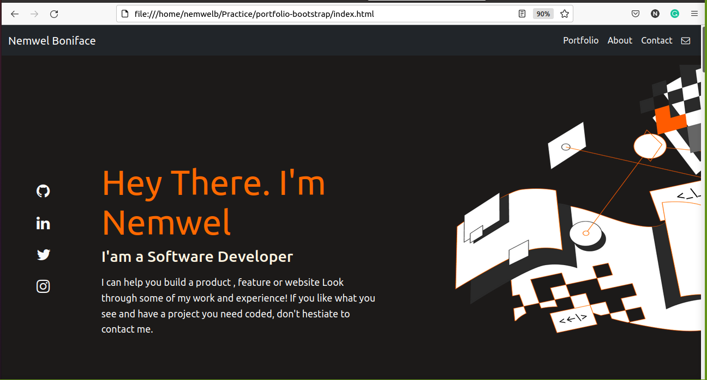
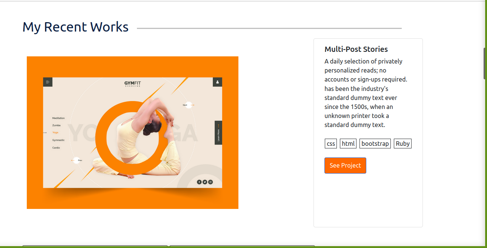
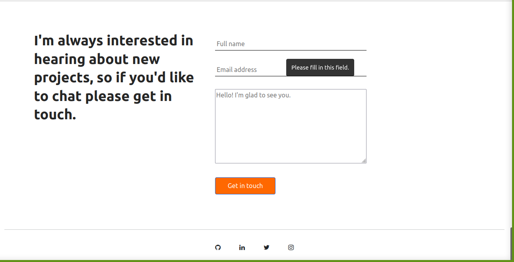

# PERSONAL PORTFOLIO

> A "portfolio" project built during pair programming practicing our bootstrap 5 skills

It is a show of our understanding of Gitflow, use of Linters, HTML5 semantics, CSS3 flexbox, Bootstrap and figma.

## Built With

- HTML-5
- CSS3
- Bootstrap 5
- Pair programming

## Live Demo

[Live Demo Link](https://nemwel-boniface.github.io/portfolio-bootstrap/)

## Getting Started

- To get a local copy up and running follow these simple example steps.

### Prerequisites

- You only need a browser to run the html file in.

### Setup

- Create a new folder to store the files in.

### Install

- Open your command prompt or terminal and run.
- git clone git@github.com:Nemwel-Boniface/personal-portfolio.git .

### Run tests

- To run tests run :
- npx hint .
- npx stylelint "**/*.{css,scss}"

### Deployment

- Project is deployed using 
- git push <branch_name>

## Authors

👤 **Author1**

- GitHub: [@Nemwel-Boniface ](https://github.com/Nemwel-Boniface)
- Twitter: [@nemwel_bonie](https://twitter.com/nemwel_bonie)
- LinkedIn: [LinkedIn](https://www.linkedin.com/in/nemwel-nyandoro-aa1b2620b/)

👤 **Author2**

- GitHub: [@ismail courr ](https://github.com/ismailco)
- Twitter: [@ismailcourr](https://twitter.com/ismailcourr)
- LinkedIn: [LinkedIn](https://www.linkedin.com/in/ismailcourr)

## 🤝 Contributing

Contributions, issues, and feature requests are welcome!

Feel free to check the [issues page](https://github.com/Nemwel-Boniface/portfolio-bootstrap/issues).

## Show your support

Give a ⭐️ if you like this project!

## Acknowledgments

- Major bigup to [@ismailcourr](https://twitter.com/ismailcourr)

## 📝 License

This project is [MIT](./MIT.md) licensed.